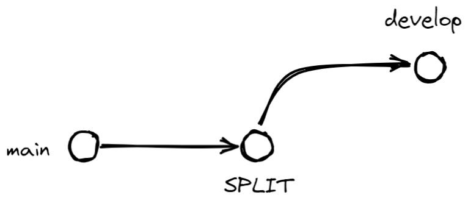

# Medisafe

First, click on the **Fork button** in the top-right corner. 


This creates a new copy of this repository under your GitHub user account with a URL like:
```bash
https://github.com/<YourUserName>/Medisafe
```

---

Next, clone the repo by opening the terminal on your computer and running the command:

```bash
git clone https://github.com/<YourUserName>/Medisafe.git
```

---

Medisafe branches:



Once the repo is cloned, you want to switch to **development** branch. For that, run the following command:

```bash
git checkout develop
```

Why do I need to do this ?
<br>
Because the **main branch** will be preserved only for changes that are tested and stable. Using a development branch is good practice because it kips the main branch clean, macking the end user experience better, by reducing the likelihood of bugs and unintended errors.

---

Now that you are on the development branch you need to do two things:

1. Create a new branch by issuing the command:

```bash
git checkout -b new_branch
```


On this branch you will make all your contributions.

2. Create a new remote for the upstream repo with the command:
```bash
git remote add upstream https://github.com/vasilecampeanu/Medisafe
```
Why you need to do this ?
</br>
Well, when a repository is cloned, it has a default remote called **origin** that points to your fork on GitHub, not the original repository it was forked from. To keep track of the original repository, you need to add another remote named. 
<br>
So, if you want to be able to keep track of the changes that are made by other members of the team you need to complete this step.

---

Now you are ready to make you first contribution to Medisafe.

---

After you finised your tasks, you want commit your changes:

```bash
git add *
git commit -m "feat: Your message"
```

After you commited your changes is time to push them to the remote repository:

```bash
git push -u origin new_branch 
```

Don't forget to specify the name of the branch you created after origin. It is no longer the develop or main branch!

Now, after you pushed your changes, on the github page you will be able to make a **Pull Request**. 

The pull request is the last step.

If you followd all the steps without mistakes your changes will be merged with the develop branch by the owner of the repository.


---

How do i get the changes tht are made by my teammates ?

To pull the changes from the upstream repository run the following command:

```bash
git fetch upstream
```
